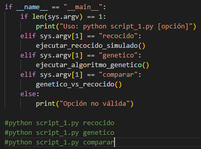
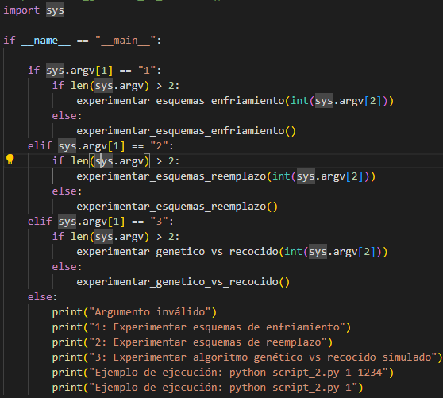
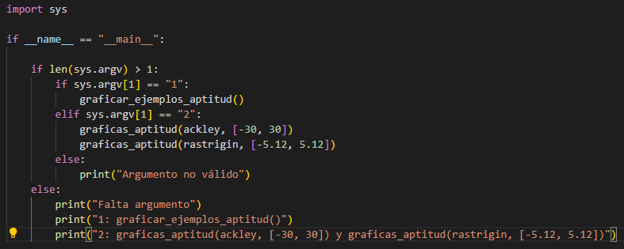

## Como ejecutar los scripts:

#### script_1.py (correspondiente a todo el ejercicico 1 de la tarea)

Tenemos 3 distintas salidas:
* La primera es haciendo **python script_1.py recocido**, esto nos dara la ejecución de los dos esquemas de enfiriamiento para el recocido simulado.

* La segunda es haciendo **python script_1.py genetico**, esto nos dara la ejecución de los esquemas de reemplazo para el 

* La tercera nos hara la comparativa de los 2 algoritmos pasados, y se ejecuta de la siguiente manera **python script_1.py comparar**

#### script_2.py (correspondiente a todo el ejercicico 2 de la tarea)

De igual manera que en el script_1_py, aqui hay distintas formas de ejecutar el script:

* La primer forma de ejecutarlo tiene dos variantes:
    - **python script_2.py 1**, con este se ejecutaran los esquemas de enfriamiento pero con una semilla aleatoria.
    - **python script_2.py 1 [semilla]**, con este se ejecutaran los esquemas de enfriamiento pero con la semilla dada. (en la captura se ve un ejemplo)

* La segunda forma de ejecutarlo igual tiene dos variantes:
    - **python script_2.py 2**, con este se ejecutaran los esquemas de reemplazo pero con una semilla aleatoria.
    - **python script_2.py 2 [semilla]**, de manera analoga, se ejecutaran los esquemas de reemplazo pero con la semilla dada.

* La tercera forma es similar a las dos anteriores:
    - **python script_2.py 3**, con esre se ejecutaran las comparaciones, de los dos esquemas anteriores con una semilla aleatoria.
    - **python script_2.py 3 [semilla]**, por ultimo, se hace lo mismo pero recibiendo una semilla.

#### script_3.py (correspondiente a todo el ejercicico 3 de la tarea)

Por ultimo, el script 3 tiene solo dos formas de ejecutarse:

* **python script_3.py 1**, esto nos ejecutara 3 graficas de aptitud, que consideramos importantes.

* **python script_3.py 2**, estos nos ejecutara las dos graficas de comparacion de los 5 esquemas en una misma grafica, tanto para ackel como para rastringin.

